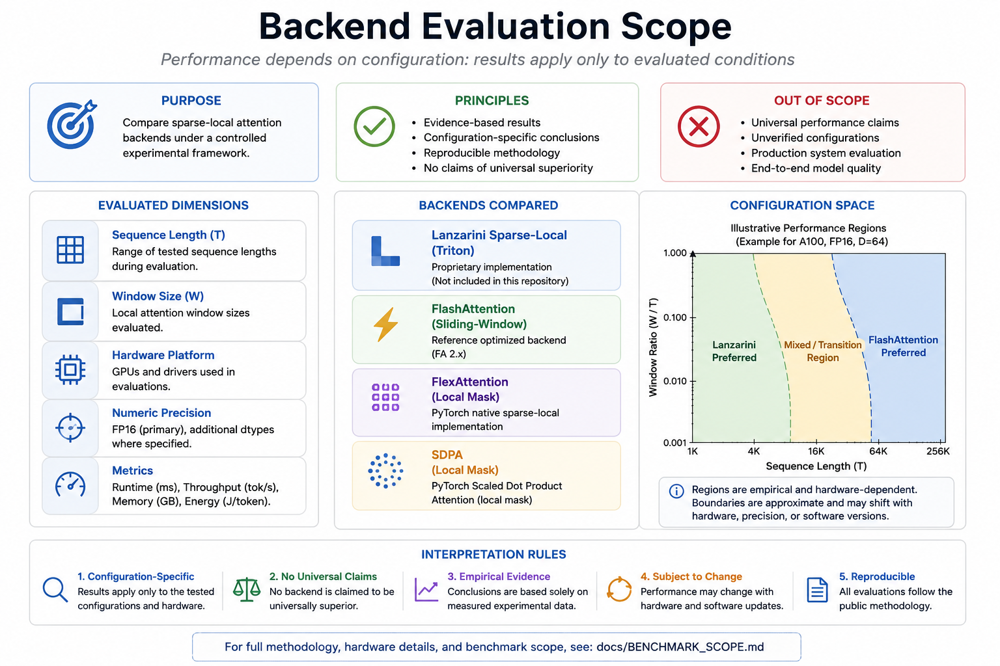

# Lanzarini Validation Suite

> **Public validation and reproducibility framework for sparse-local attention research.**


---

# Overview

The **Lanzarini Validation Suite** is a public scientific framework designed to support transparent validation, reproducibility, and independent inspection of sparse-local attention research.

Unlike repositories that primarily distribute optimized implementations, this project focuses on documenting **how experimental evidence is generated, validated, interpreted, and reproduced**.

The repository intentionally separates:

- mathematical specification;
- public validation methodology;
- correctness evaluation;
- benchmark documentation;
- reproducibility workflow;
- experimental evidence;
- proprietary implementation.

The proprietary Triton implementation remains intentionally excluded from the public repository.

---

# Current Status

**Repository status**

✅ Stable Public Release

Current validation progress:

| Stage | Status |
|--------|--------|
| V1 | ✅ Complete |
| V2 | ✅ Complete |
| V3 | ✅ Complete |

Current public capabilities include:

- Public validation workflow
- Reproducibility documentation
- Machine-readable validation artifacts
- SHA-256 integrity verification
- GitHub Actions continuous validation
- Public benchmark reports

---

# Repository Scope

This repository documents the public validation component of the Lanzarini sparse-local attention research project.

The repository includes:

- mathematical specification;
- validation methodology;
- correctness criteria;
- benchmark scope;
- computational complexity;
- reproducibility workflow;
- public validation artifacts;
- experimental checkpoint reports.

The repository intentionally **does not** include:

- proprietary Triton kernels;
- backend-selection implementation;
- production inference code;
- private research code.

The objective is to maximize scientific transparency while preserving implementation confidentiality.

---

# Scientific Position

The Validation Suite does **not** claim:

- a novel sparse-local attention operator;
- a new Transformer architecture;
- a new foundation model;
- universal runtime superiority;
- universal energy reduction.

Instead, the repository provides:

- documented experimental methodology;
- reproducible validation procedures;
- publicly inspectable evidence;
- transparent interpretation of measured results.

Scientific conclusions are always limited to the documented experimental configurations.

---

# Repository Guide

The repository is organized into five complementary sections.

| Section | Purpose |
|----------|---------|
| `README.md` | Project overview |
| `docs/` | Technical documentation |
| `paper/` | Scientific reports and consolidated results |
| `reports/` | Validation reports |
| `artifacts/` | Public validation artifacts |

---

# Documentation

The complete technical documentation is available inside the **docs/** directory.

| Document | Purpose |
|----------|---------|
| `SPECIFICATION.md` | Mathematical specification of the sparse-local attention operator |
| `COMPLEXITY.md` | Computational complexity analysis |
| `CORRECTNESS.md` | Correctness criteria |
| `ADAPTER_INTERFACE.md` | Public adapter interface |
| `VALIDATION_METHOD.md` | Public validation methodology |
| `BENCHMARK_SCOPE.md` | Benchmark interpretation and scope |
| `LIMITATIONS.md` | Known limitations |

Additional scientific documentation is available in:

| Document | Purpose |
|----------|---------|
| `paper/METHOD.md` | Canonical methodological reference |
| `paper/RESULTS.md` | Consolidated experimental results |
| `paper/CLAIM_LEDGER.md` | Evidence-based scientific claim mapping |

---

# Experimental Results

The repository contains public summaries of experimentally validated checkpoints from the Lanzarini sparse-local attention research program.

These reports preserve:

- numerical correctness evaluations;
- runtime measurements;
- benchmark observations;
- validation methodology;
- documented limitations;
- reproducible experimental artifacts.

The proprietary implementation is intentionally excluded.

The published reports describe only experimentally evaluated configurations.

No undocumented experiments are used to support scientific claims.

---

# Experimental Evidence

The Validation Suite preserves public evidence generated during multiple validation campaigns.

Representative experimental topics include:

- correctness validation;
- runtime benchmarking;
- benchmark reproducibility;
- validation artifact generation;
- SHA-256 integrity verification;
- backend comparison under documented benchmark configurations.

Some reports contain complete row-level measurements.

Others preserve consolidated summaries when the original raw artifacts are unavailable.

Each report explicitly states its own scope and limitations.

---

# Evidence Policy

The repository follows a strict evidence-based documentation policy.

Scientific claims are made only when supported by publicly documented experimental evidence.

Accordingly:

- experimentally validated results are clearly distinguished from theoretical discussion;
- future work is explicitly identified as future work;
- undocumented experiments are never used to support scientific conclusions;
- benchmark observations are limited to the tested configurations.

The absence of a claim should not be interpreted as evidence against a result.

It only indicates that no public experimental evidence is currently provided by this repository.

---

# Research Claims

The Validation Suite makes only limited evidence-based claims.

## Supported Claims

The repository publicly documents:

- a reproducible validation workflow;
- a mathematical specification of the evaluated operator;
- correctness evaluation methodology;
- computational complexity analysis;
- benchmark interpretation guidelines;
- validation artifacts;
- reproducibility procedures.

---

## Explicit Non-Claims

This repository does **not** claim:

- a novel attention mechanism;
- universal performance superiority;
- universal energy reduction;
- correctness outside documented benchmark configurations;
- disclosure of proprietary implementation details.

Scientific conclusions remain limited to the documented experimental evidence.

For a complete mapping between claims, supporting evidence and limitations, see:

`paper/CLAIM_LEDGER.md`

---

# Public Validation Framework

The Validation Suite is designed to improve scientific transparency.

Instead of publishing only benchmark numbers, the repository documents the complete validation process.

The public framework includes:

- validation methodology;
- correctness evaluation;
- benchmark protocols;
- reproducibility workflow;
- artifact generation;
- integrity verification.

This separation allows independent inspection without exposing proprietary implementation details.

---

# Objectives

The Validation Suite has the following objectives:

- improve reproducibility;
- support independent verification;
- document benchmark methodology;
- evaluate numerical correctness;
- preserve experimental evidence;
- generate machine-readable artifacts;
- verify artifact integrity.

The project emphasizes reproducibility before performance claims.

---

# Motivation

GPU attention benchmarks are often difficult to reproduce because implementations, benchmark procedures and validation protocols are rarely documented in a consistent manner.

The Validation Suite addresses this problem by documenting:

- execution environment;
- validation workflow;
- mathematical specification;
- correctness methodology;
- benchmark procedures;
- generated artifacts;
- integrity verification.

The repository focuses on scientific validation rather than implementation disclosure.

---

# Why It Matters

Reliable validation infrastructure benefits the research community by enabling:

- independent verification;
- transparent benchmarking;
- reproducible experimentation;
- long-term preservation of experimental evidence.

Potential application domains include:

- Large Language Models
- AI inference infrastructure
- GPU kernel research
- Edge AI
- Vision Transformers
- Scientific computing
- Robotics
- Long-context inference
- Time-series AI

The Validation Suite provides the infrastructure for evidence-based evaluation rather than promoting a specific implementation.

---

# Quick Start

Clone the repository:

```bash
git clone https://github.com/vlanzarini80-source/Lanzarini-Validation-Suite.git
cd Lanzarini-Validation-Suite
```

Run the public validation workflow:

```bash
python scripts/v1a_environment_check.py
python scripts/v1b_adapter_contract.py
python scripts/v1c_micro_correctness.py
python scripts/v1d_runtime_benchmark.py
python scripts/v1e_artifact_manifest.py
python scripts/v1f_report_generator.py
```

---

# Public Repository Behaviour

The proprietary sparse-local attention implementation is intentionally excluded.

Expected behavior:

| Stage | Expected Result |
|--------|-----------------|
| V1A | PASS |
| V1B | PASS or SKIPPED_PUBLIC_MODE |
| V1C | SKIPPED_PUBLIC_MODE (without private adapter) |
| V1D | SKIPPED_PUBLIC_MODE (without private adapter) |
| V1E | PASS |
| V1F | PASS |

The absence of the proprietary adapter should not be interpreted as a failure of the Validation Suite.

---

# Validation Pipeline

The Validation Suite follows a staged validation workflow.

```text
Environment
     │
     ▼
V1A ─ Environment Validation
     │
     ▼
V1B ─ Adapter Validation
     │
     ▼
V1C ─ Correctness Validation
     │
     ▼
V1D ─ Runtime Validation
     │
     ▼
V1E ─ Artifact Integrity Audit
     │
     ▼
V1F ─ Report Generation
```

Each stage validates one component before the following stage is executed.

---

# Repository Structure

```
Lanzarini-Validation-Suite/

README.md
ROADMAP.md
CHANGELOG.md
LICENSE
CITATION.cff

docs/
paper/
reports/
artifacts/
scripts/
examples/
figures/
json/
.github/
```

---

# Public Artifacts

The Validation Suite publishes machine-readable artifacts including:

- JSON reports
- CSV reports
- Markdown reports
- HTML reports
- SHA-256 integrity manifests

These artifacts allow independent inspection of the documented validation workflow.

---

# Scientific Scope

The Validation Suite experimentally validates:

- execution environment;
- correctness;
- runtime behavior;
- validation methodology;
- reproducibility workflow;
- artifact integrity.

The repository does **not** claim:

- universal algorithmic superiority;
- mathematical novelty;
- correctness outside documented benchmark conditions;
- universal runtime or energy improvements.

Scientific conclusions remain limited to experimentally evaluated configurations.

---

# Backend Evaluation Scope



Experimental evidence indicates that backend performance depends on the evaluated configuration.

Accordingly, backend comparisons should be interpreted only within the documented benchmark conditions.

The repository does not claim that any backend is universally superior.

---

# Reproducibility

Every published validation stage generates reproducible artifacts.

Depending on the stage these may include:

- JSON summaries;
- CSV measurements;
- Markdown reports;
- HTML reports;
- SHA-256 manifests.

These artifacts support independent verification of the reported validation workflow.

---

# Intended Audience

This repository is intended for:

- machine learning researchers;
- GPU systems researchers;
- AI infrastructure engineers;
- reproducibility studies;
- academic reviewers;
- kernel developers.

---

# Citation

If this repository contributes to academic work, please cite the associated publication when available.

Citation metadata is provided through:

```
CITATION.cff
```

---

# License

This repository distributes only the public Validation Suite.

The proprietary sparse-local attention implementation, backend-selection logic and Triton kernels remain intentionally private.

The public repository is released under the MIT License.

---

# Author

**Valentino Lanzarini**

Independent Research Project

GitHub:

https://github.com/vlanzarini80-source

Contact:

vlanzarini80@gmail.com

---

# Disclaimer

The purpose of this repository is to improve transparency, reproducibility and independent verification of sparse-local attention research.

All reported benchmark results are configuration-specific and supported only by the documented experimental evidence contained in this repository.

Nothing contained in this repository should be interpreted as demonstrating universal superiority of any implementation.

The proprietary implementation remains intentionally excluded.

---

# Guiding Principle

> **Every scientific statement in this repository is evidence-based.**
>
> Measured experimental evidence is clearly separated from theoretical discussion, planned work and proprietary implementation details.
